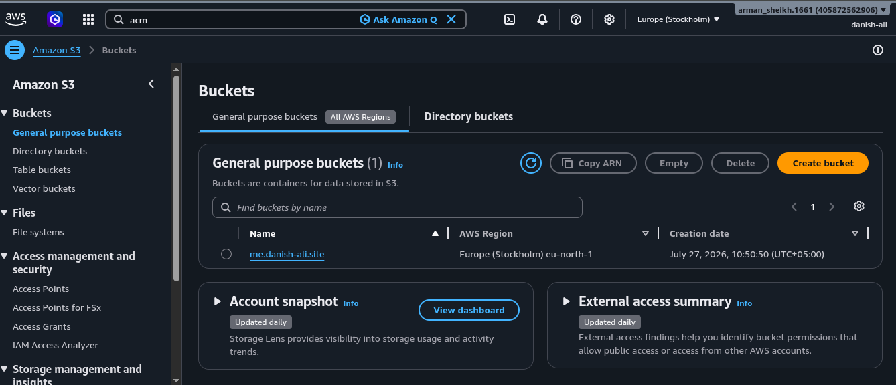
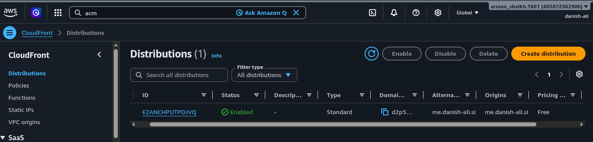
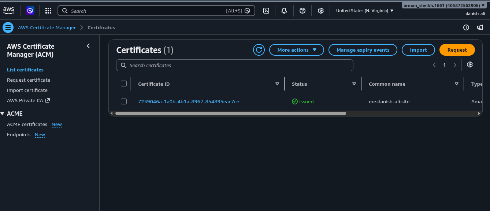
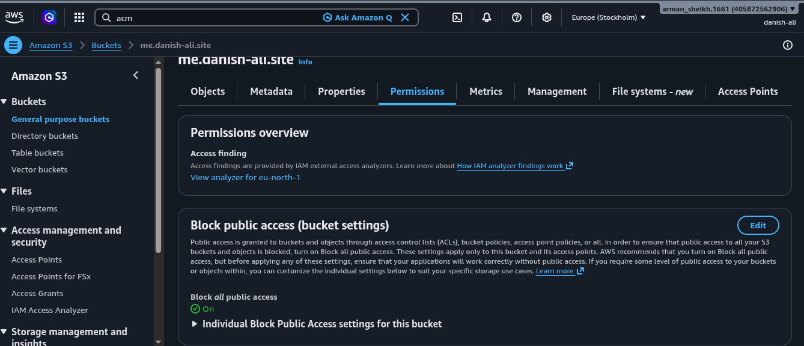
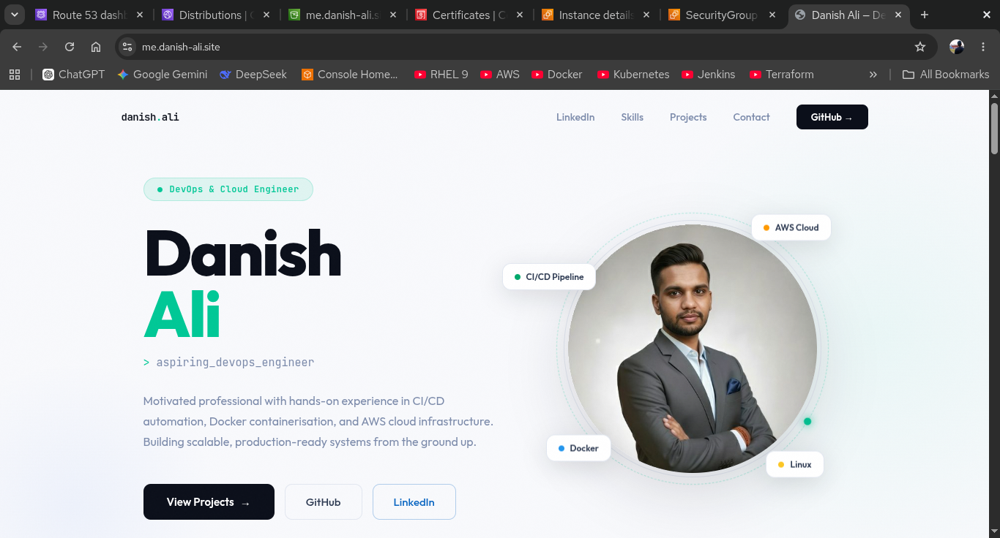

# Static Website Hosting on AWS S3 with CloudFront, Route 53, and ACM

This project demonstrates how to host a static website securely on Amazon S3 using CloudFront, Route 53, and AWS Certificate Manager (ACM). The website is served over HTTPS through a custom domain, while the S3 bucket remains private for better security.

## Overview

The deployment flow is:

1. Upload the static website files to an Amazon S3 bucket.
2. Keep the S3 bucket private.
3. Use CloudFront as the content delivery layer in front of S3.
4. Attach an ACM SSL certificate to CloudFront.
5. Configure Route 53 to route the custom domain to CloudFront.

This setup solves the initial issue where the website worked via the CloudFront URL but showed a security error when accessed through the custom domain.

## Architecture

The final architecture looks like this:

- User requests the domain through Route 53
- Route 53 routes traffic to CloudFront
- CloudFront serves the website securely over HTTPS
- CloudFront fetches content from the private S3 bucket

## Screenshots

### S3 Bucket Configuration

### CloudFront Distribution

### ACM Certificate

### S3 Bucket Permissions

### SSL and Domain Setup

## Step-by-Step Deployment

### 1. Create an S3 Bucket
- Create an S3 bucket with a name matching your website domain.
- Upload your static website files such as HTML, CSS, and images.
- Enable static website hosting if needed for testing, but in this setup the bucket is kept private and accessed through CloudFront.

### 2. Configure S3 Bucket Security
- Keep the bucket private.
- Use an Origin Access Identity (OAI) or CloudFront access policy so CloudFront can fetch objects from the bucket securely.
- Do not make the bucket public.

### 3. Create a CloudFront Distribution
- Create a CloudFront distribution.
- Set the S3 bucket as the origin.
- Configure the distribution to use HTTPS.
- Attach the ACM certificate for your custom domain.

### 4. Request and Attach an ACM Certificate
- Create an SSL certificate in ACM.
- Validate the domain ownership.
- Make sure the certificate is created in the us-east-1 region because CloudFront requires certificates from that region.
- Attach the certificate to the CloudFront distribution.

### 5. Configure Route 53
- Create or update a hosted zone for your domain.
- Create an A record or Alias A record pointing your domain to the CloudFront distribution.
- This ensures visitors can access the website using the custom domain securely.

### 6. Test the Website
- Open the CloudFront URL to verify the site is served.
- Open the custom domain in a browser.
- Confirm that HTTPS works without security warnings.

## Why This Works

The main reason the domain showed a security issue before was that the site was not fully configured with a valid SSL certificate for the custom domain. Once the ACM certificate was attached to CloudFront and Route 53 pointed the domain to that distribution, HTTPS worked correctly.

## Files in This Project

- index.html: Main website content
- Images used in this documentation: s3.png, cloudfront.png, asm.png, permission.png, ss.png

## Result

The static website is now hosted securely with:

- Private S3 storage
- CloudFront delivery
- HTTPS enabled through ACM
- Custom domain routing via Route 53
